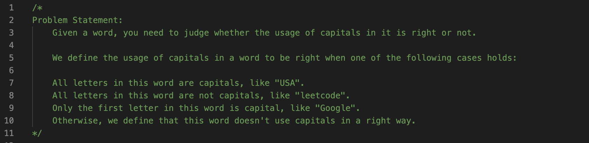
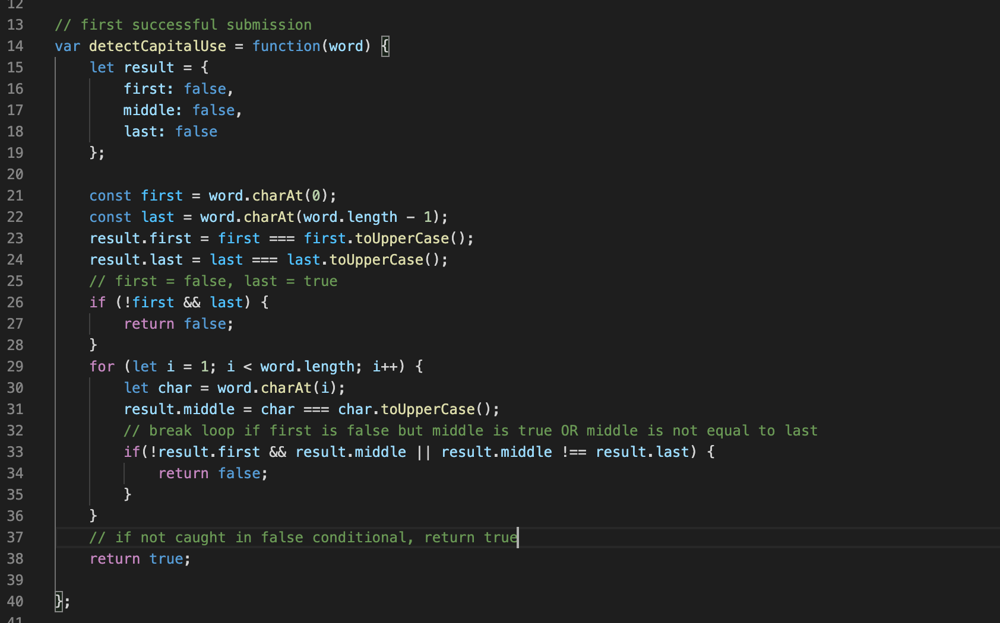
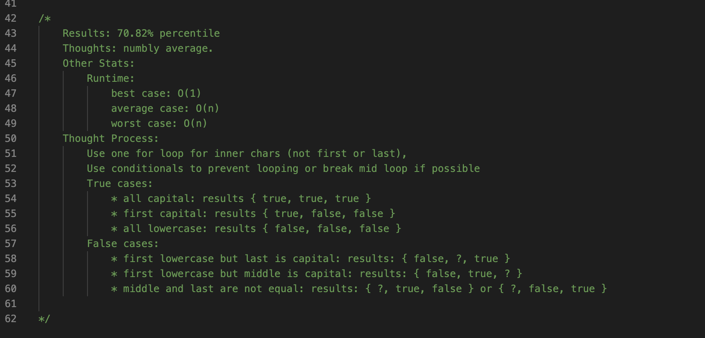

# Algorithm Practice
This is where I will be storing my submissions of the August LeetCode Challenge & HackerRank questions.

## Join Me!
If you would like to contribute or add your own problems, open an issue or email me ([see my profile](#author)) and I can add you as a contributor.

## Current Challenge: August
Inside the folder "augustChallenge" you will find a .js file that contains the problem statement, my successful submission, its results, and my thought process. 
I will primarily use this github as a way to document and review my algorithm practice. 

## Example
Problem Statement: 

Successful Submission: 

Results & Reflection:

## HackerRank
I will also be posting questions from HackerRank that I couldn't figure out on my own, and posting updates & notes of what I learn from each question as I dive into the solution.
Format of .js files for each question will follow the example above.

## Author
[crispysodium](https://www.github.com/crispysodium)

## Collaborators & Contributors
Your github username could be here! See [Join Me](#join-me-!)

